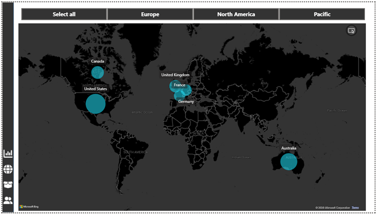

# Sales & Customer Analytics Dashboard
### Power BI | AdventureWorks Dataset

## Overview
An interactive multi-page Power BI dashboard analysing sales performance, 
customer behaviour, and product profitability for a global bike retailer. 
Built using the AdventureWorks dataset with advanced DAX measures and 
dynamic visuals.

## Dashboard Pages

### Executive Dashboard
High-level KPIs including total revenue ($24.9M), profit ($10.5M), 
orders (25.2K), and return rate (2.2%). Includes revenue trending, 
top 10 products by orders and revenue, and month-over-month comparisons.

### Customer Detail
Analysis of 17.4K unique customers with average revenue per customer 
of €1,431. Breaks down orders by income level and occupation. 
Top 100 customers ranked by revenue with dynamic year filtering.

### Product Detail
Drill-through page for individual product performance. Features gauge 
charts tracking monthly orders, revenue, and profit vs. target. 
Includes price adjustment parameter and AI-generated report summary.

### Geographic Map
Global sales distribution across Europe, North America, and Pacific 
regions with bubble map showing revenue concentration by country.

## Key Insights
- Accessories lead in order volume (17K) while Bikes drive the most revenue
- Top customer Mr. Maurice Shan generated $12K across 6 orders
- Water Bottle 30oz. is the most ordered product with 3,983 orders
- US market dominates global sales volume
- Monthly revenue trending upward with $1.83M in the most recent month

## Technical Highlights
- 20+ DAX measures including Adjusted Revenue, 10 Day Rolling Revenue, 
  90 Day Rolling Profit, and Bike Return Rate
- Star schema data model with a dedicated Measure Table
- Dynamic what-if parameter for price adjustment scenarios
- Drill-through navigation across 8 report pages
- AI-powered Smart Narrative summaries

## Tools Used
- Power BI Desktop
- DAX (SUMX, CALCULATE, rolling window measures)
- Data modelling — star schema
- Power BI Map visual (Bing Maps)

## Screenshots

